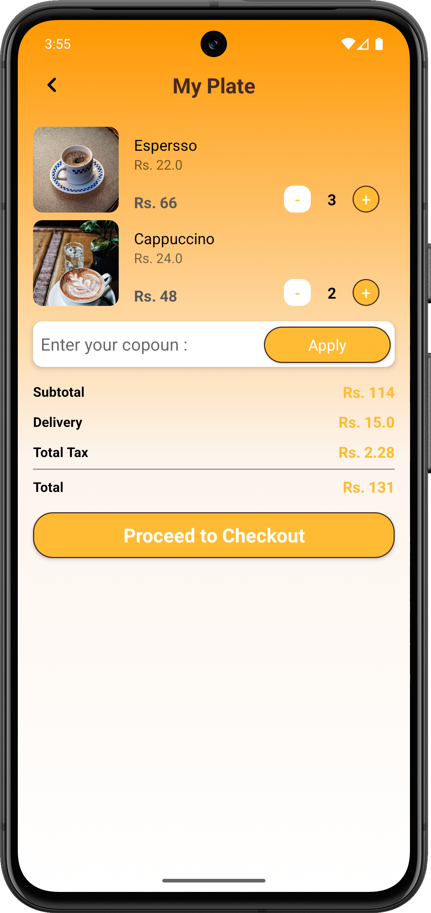

# Cafe Menu App

## Overview
Welcome to the **Cafe Menu App**! This application is designed for coffee enthusiasts and cafe lovers. Our app specializes in presenting a beautifully designed digital menu for a cafe that excels in serving the finest coffee. You can browse through our menu, choose your favorite coffee, and place an order for your perfect brew effortlessly.

## Features
- **Coffee Menu**: Browse an extensive selection of coffees, from espressos to lattes.
- **Personalized Experience**: Choose your preferred size, sugar level, and add-ons like whipped cream or flavored syrups.
- **Order Your Brew**: Place an order directly from the app.
- **User-Friendly Interface**: Navigate the menu with ease and enjoy a seamless ordering experience.

## Technologies Used
- **Frontend**: Flutter (Dart)
- **Backend**: Firebase for order management and database.
- **Design**: Modern UI/UX principles to ensure a visually appealing and intuitive app.

## How to Use
1. **Browse**: Open the app to explore the coffee menu.
2. **Select**: Tap on your desired coffee to customize it.
3. **Order**: Place your order with a simple click.
4. **Enjoy**: Visit the cafe to pick up your freshly brewed coffee.

## Screenshots
Below are a few screenshots showcasing the app:

1. **Home Screen**: Browse the menu and discover our coffee collection.
   

2. **Coffee Details**: Customize your coffee and view detailed descriptions.
   

3. **Order Screen**: Review your order before confirming.
   

4. **Confirmation Screen**: Get notified once your order is placed successfully.
   

## Future Enhancements
- Integration with payment gateways for online payments.
- Loyalty points system for frequent customers.
- Notifications for offers and new menu items.

---
Thank you for using the **Cafe Menu App**. Enjoy your coffee journey with us!